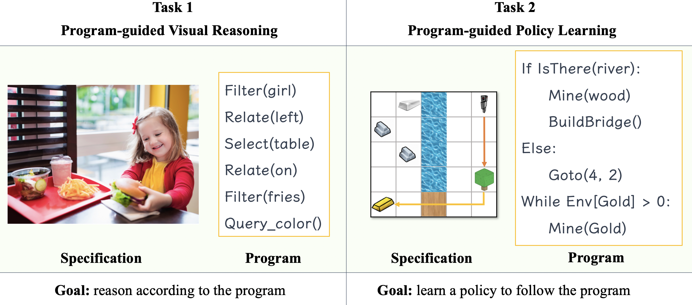
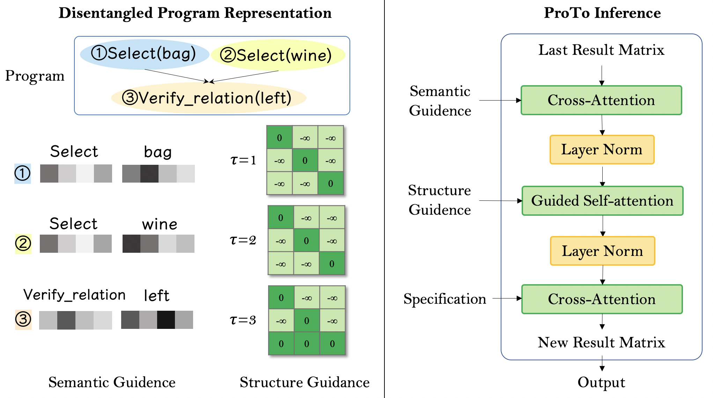

# ProTo: Program-Guided Transformer for Program-Guided Tasks

This repository is the official implementation of [ProTo: Program-Guided Transformer for Program-Guided Tasks](https://arxiv.org/abs/2110.00804).

Youtube link: https://www.youtube.com/watch?v=Dd8EHqMfOPI&t=24s

Exemplar program-guided tasks:



ProTo model illustrated:



## Abstract:

Programs, consisting of semantic and structural information, play an important role in the communication between humans and agents. Towards learning general program executors to unify perception, reasoning, and decision making, we formulate program-guided tasks which require learning to execute a given program on the observed task specification. Furthermore, we propose the Program-guided Transformer (ProTo), which integrates both semantic and structural guidance of a program by leveraging cross-attention and masked self-attention to pass messages between the specification and routines in the program. ProTo executes a program in a learned latent space and enjoys stronger representation ability than previous neural-symbolic approaches. We demonstrate that ProTo significantly outperforms the previous state-of-the-art methods on GQA visual reasoning and 2D Minecraft policy learning datasets. Additionally, ProTo demonstrates better generalization to unseen, complex, and human-written programs.

## News

**2022.April.15** Docs finish construction.

**2021.Nov.27** Code is available at Github. Docs are under constructing.

## Requirements

To install requirements:

```shell
# create conda environment
conda create --name proto python=3.7
conda activate proto
# install general packages
pip install -r requirements.txt
```

#### GQA

1. Dataset download from [the official website](https://cs.stanford.edu/people/dorarad/gqa/download.html):

   ```
   bash scripts/download_gqa.sh
   ```

1. Feature extraction via [bottom up attention](https://github.com/MILVLG/bottom-up-attention.pytorch#Pre-trained-models). The pre-trained features are from meta modular networks.

```shell
# clone repo
git clone --recursive https://github.com/MILVLG/bottom-up-attention.pytorch
# install detectron2
cd detectron2
pip install -e .
cd ..
# install apex
git clone https://github.com/NVIDIA/apex.git
cd apex
python setup.py install
cd ..
# install bottom up attention repo
python setup.py build develop
pip install ray
```

#### Minecraft

The original data and code are not available due to license issue (the original Minecraft dataset is from the Google company). However, I can provide help if you drop me an email: zelin@link.cuhk.edu.hk.

## Training

#### GQA

To train the model(s) in the paper, run this command:

```train
python run_experiments.py
```

Using -h to see the possible options.

#### Minecraft

The original data and training code are not available due to license issue (the original Minecraft dataset is from the Google company). However, I can provide help if you drop me an email: zelin@link.cuhk.edu.hk.

## Evaluation

To evaluate my model on ImageNet, run:

```eval
python run_experiments.py --do_eval
```

## Reference and acknowledgement

Cite our paper:

@misc{zhao2021proto,
title={ProTo: Program-Guided Transformer for Program-Guided Tasks},
author={Zelin Zhao and Karan Samel and Binghong Chen and Le Song},
year={2021},
eprint={2110.00804},
archivePrefix={arXiv},
primaryClass={cs.LG}
}

## Contributing

Please raise an issue if you found a bug and we welcome pull requests.
